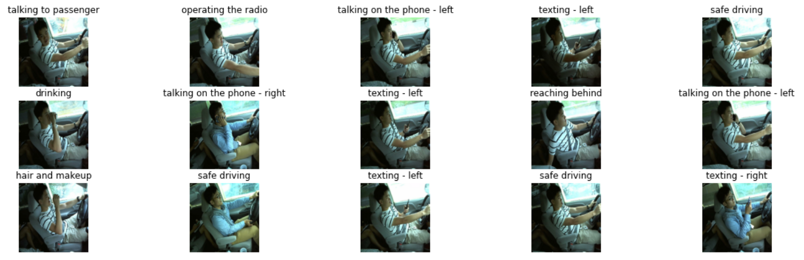

# Distracted Driver Classification 🚗🚙🚌

### 1. Problem

Predict the **Likelihood** : What the **Driver** is doing in Each Picture?

We need to **Classify** Images into following 10 Classes 

- c0: Safe Driving
- c1: Texting (Right) 
- c2: Talking on the Phone (Right)
- c3: Texting (Left)
- c4: Talking on the Phone (Left)
- c5: Operating the Radio
- c6: Drinking
- c7: Reaching Behind
- c8: Makeup
- c9: Talking to Pessenger

### 2. Data

**[Kaggle's State Farm Distracted Driver Detection](https://www.kaggle.com/c/state-farm-distracted-driver-detection/data)**

### 3. Features

**Data Set** consist of **Driver Images**, each taken inside a Car with a Driver doing something.
- Texting | Talking on the Phone
- Operating Radio | Music Player
- Talking with Passenger
- Makeup
- Drinking 
- Reaching Behind for some Object on the Back Seat.

### 4. Files 
1. **images.zip** - All ( Train and Test ) Images.
2. **sample_submission.csv** - Sample Submission File in the Correct Format.
3. **driver_images_list.csv** - List of Training Images with Driver ID and Class ID.

### 5. Libraries
1. NumPy
2. Pandas
3. Matplotlib
4. Sklearn
5. Keras ( Utils )
6. Tensorflow ( Open Source Library to Develop and Train ML Models )

### 6. Approach
- **Orignal** Image Dimensions - 480 x 640 x 3
- **Reduced** Image Dimensions - 240 x 240 x 3
- Total Number of Images : 2242
- **tensorflow.keras.utils.to_categorical** : Converts a **Class Vector** ( **Integers** ) to **Binary Class** `Matrix` ( Dummy Encoding )

### 7. Parameters of Layers ( **tensorflow.keras.layers**  )

### 1. **Conv2D** : 2D Convolution Layer    
- **filters** : Number of Filters in Convolution.
- **kernel_size** : Size of Window. 
- **strides** : How Far will Pooling Window Move | Steps.
- **padding** : valid ( no padding ) or same ( Add Same Padding from all sides )
- **input_shape** : Size of Batch or Window.

### 2. Flatten
- **flattens** the Input ( Down Sampling :  e.g ( output = ( 1, 10, 64 ) flattens to output = ( 640 ) i.e 1 x 10 x 64 = 640 )

### 3. MaxPooling2D
- **pool_size** : Window Size ( Even if only one Integer is Passed it will be considered for both e.g. If 2 is Passes it is ( 2, 2 ) )
- **strides** : How Far will Pooling Window Move | Steps.
- **padding** : valid ( no padding ) or same ( Add Same Padding from all sides )

### 3. BatchNormalization ( Transformation : `Mean` = 0 and `Standard Deviation` close to 1  )
- Stabilized the **Learning** ( Reduces the Number of Training **Epochs** and **Time** required to Train the Neural Network )
- Network becomes **Unbiased**.
- Makes Optimization Fast by Restricting Weights to Certain **Range**.
- Computes **Means** and **Variance** of the Feature in **Mini Batch**.
- Subtracts **Mean** and Divides the Feature by its Mini Batch **Standard Deviation**.
- **axis** : Axis to be Normalized. 
- **epsilon** : Variance Added to Prevent from Divide by 0 Error.

### 4. Activation
- **activation** : Name of Activation Function to be Applied ( e.g. activation = "relu" ) 

### 5. Performance Measure 
- **loss** : categorical_crossentropy ( Probability Value between 0 and 1 ) and accuracy.
- Set Callback for Early Stoping to Prevent from Overfitting, monitor by val_accuracy and patience = 5 ( Loss <= 5 )

> **batch_size** ( Training Data Set Size ) and **epochs** ( Number of Epochs : One Cycle of Full Training )

<table align=center>
  <tr><td></td></tr>
</table>
